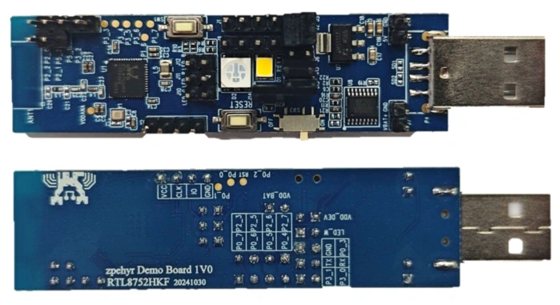

RTL8752H Dongle
#############

Overview
********

Common hardware features of the RTL8752H series:

- ARM Cortex-M0+ core
- Bluetooth low energy and 802.15.4
- 352kByte ROM, 120kByte RAM, and a maximum 8M-bit MCM Flash
- Ultra-low-power, power management unit
- Analog-to-digital converter (ADC)
- Smart I/O distribution controller
- Analog microphone (MIC) interface
- IR transceiver
- Hardware key-scan
- Quad-decoder
- QFN package

The `RTL8752H Introduction`_ has detailed hardware information about specific part number of RTL8752H series.

Dongle Board
============================

- On-board Antenna
- 40M XTAL
- Voltage converter
- 1 RGB LED, 1 normal LED and 2 keys
- USB to UART converter

Supported Features
==================

RTL8752H-Dongle's board configuration supports the following hardware features:

+-----------+------------+-------------------------------------+
| Interface | Controller | Driver/Component                    |
+===========+============+=====================================+
| NVIC      | on-chip    | nested vector interrupt controller  |
+-----------+------------+-------------------------------------+
| SYSTICK   | on-chip    | systick                             |
+-----------+------------+-------------------------------------+
| GPIO      | on-chip    | gpio                                |
+-----------+------------+-------------------------------------+
| PINMUX    | on-chip    | pinctrl                             |
+-----------+------------+-------------------------------------+
| CLOCK     | on-chip    | clock control                       |
+-----------+------------+-------------------------------------+
| UART      | on-chip    | serial port                         |
+-----------+------------+-------------------------------------+

Other hardware features are not currently supported in Zephyr.

Connections and IOs
===================

Please refer to `RTL8752H EVB Interfaces Distribution`_ which has detailed information about board interfaces.

System Clock
============
The RTL8752H features a 40MHz crystal oscillation circuit that is integrated within the device, ensuring a reliable and consistent system clock.

Serial Port
===========

The RTL8752H series has 3 UARTs. By default, UART2 is configured for the console and log output.

LED
===========

- LED = P4_3
- RGB LED

  - LED_R = P4_1
  - LED_G = P4_2
  - LED_B = P4_0

Buttons
===========

- RESET
- SW1 = P2_4

Programming and Debugging
*************************

Prerequsite
============

Essential Images
-------------------

To successfully run a Zephyr application on the RTL8752H board, some essential images provided by Realtek must be programmed into the board, in addition to the Zephyr image.

`RTL8752H EVB Hardware Connection and Download Guide`_ provides a structured approach to understanding these images, wiring for
download mode, and step-by-step instructions for flashing them.

Programming
===========

Before using the J-Link to flash the Zephyr image, it's essential to first configure it correctly by referring to the `J-Link Setup Guide`_.
Ensure that the J-Link is properly configured and connected to the board. Once the setup is verified, proceed to build and flash the :zephyr:code-sample:`hello_world` application.

.. zephyr-app-commands::
    :zephyr-app: samples/hello_world
    :board: rtl8752h_dongle
    :goals: build flash

To visualizing the console log:

#. Connect the UART:

    - UART2 TX/RX: P3_0/P3_1.

#. Open a serial communication tool that you are familiar with:

    - Set the baudrate to 2000000.

#. Press the reset button:

    - You should see “Hello World! rtl8752h_dongle” in your terminal.

Debugging
=========

You can debug an application in the usual way.

.. zephyr-app-commands::
   :zephyr-app: samples/hello_world
   :board: rtl8752h_dongle
   :maybe-skip-config:
   :goals: debug

References
**********

.. target-notes::

.. _RTL8752H Introduction:
    https://www.realmcu.com/en/Home/Product/RTL8752H-Series

.. _RTL8752H EVB Interfaces Distribution:
    https://www.realmcu.com/en/Home/DownloadList/9cc897a4-05fe-4d1e-8afb-ede637fd1e21

.. _RTL8752H EVB Hardware Connection and Download Guide:
    https://github.com/rtkconnectivity/realtek-zephyr-project/wiki/%5BRTL8752H-EVB%5D-Hardware-Connection-and-Download-Guide

.. _JLink Configuration:
    https://github.com/rtkconnectivity/realtek-zephyr-project
