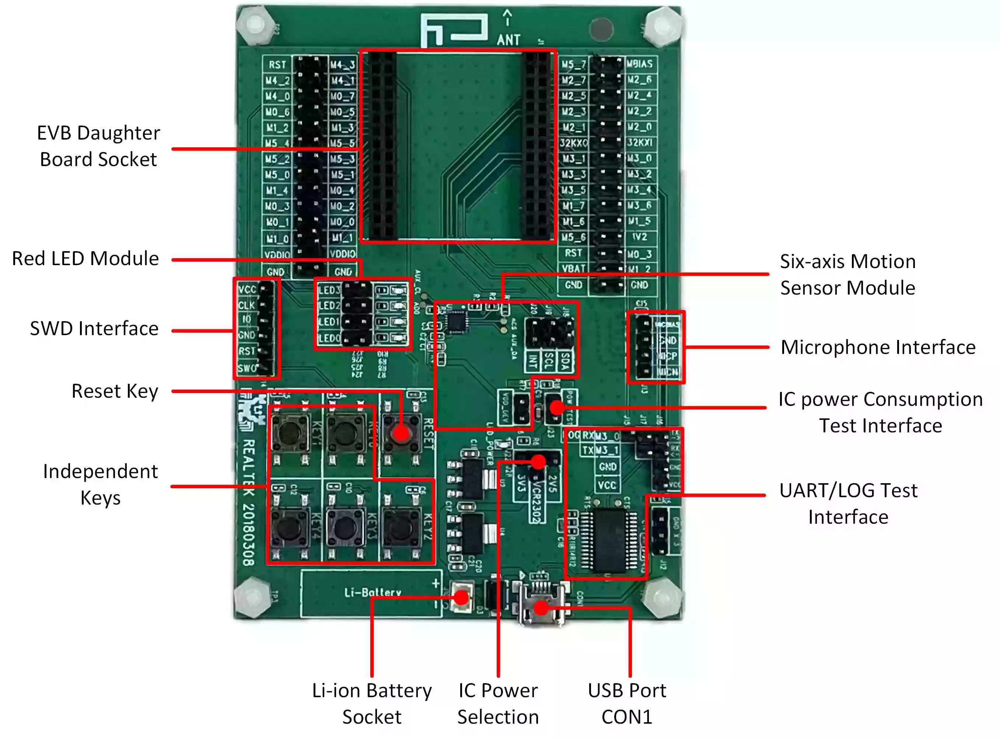

.. _rtl8752h_evb:

Overview
********

RTL8752H evaluation board works along with an interchangeable daughterboard that houses
a RTL8752H series SoC.

The RTL8752H evaluation board is compatible with the following daughter boards:

- RTL8752HJL/RTL8752HMF Daughter Board
- RTL8752HJF/RTL8752HKF Daughter Board

Hardware
********

SoC Series
==================

The RTL8752H series contains various chip types, each supporting different hardware features.

Below are the common hardware features of the RTL8752H series:

- ARM Cortex-M0+ core
- Bluetooth low energy and 802.15.4
- 352kByte ROM, 120kByte RAM, and a maximum 8M-bit MCM Flash
- Ultra-low-power, power management unit
- Analog-to-digital converter (ADC)
- Smart I/O distribution controller
- Analog microphone (MIC) interface
- IR transceiver
- Hardware key-scan
- Quad-decoder
- QFN package

The `RTL8752H Introduction`_ has detailed hardware information about specific part number of RTL8752H series.

Board
==================

RTL8752H Evaluation Board supports these features:

- 5V to 3.3V and 2.5V LDO power modules
- Six-axis motion sensor module
- Reset key and 5 independent keys
- Support audio module interface
- Red LED module
- USB to UART chip, FT232RL

Supported Features
==================

RTL8752H-EVB's configuration supports the following hardware features:

+-----------+------------+-------------------------------------+
| Interface | Controller | Driver/Component                    |
+===========+============+=====================================+
| NVIC      | on-chip    | nested vector interrupt controller  |
+-----------+------------+-------------------------------------+
| SYSTICK   | on-chip    | systick                             |
+-----------+------------+-------------------------------------+
| GPIO      | on-chip    | gpio                                |
+-----------+------------+-------------------------------------+
| PINMUX    | on-chip    | pinctrl                             |
+-----------+------------+-------------------------------------+
| CLOCK     | on-chip    | clock control                       |
+-----------+------------+-------------------------------------+
| UART      | on-chip    | serial port                         |
+-----------+------------+-------------------------------------+

Other hardware features are not currently supported by Zephyr.

Connections and IOs
===================

Please refer to `RTL8752H EVB Interfaces Distribution`_ which has detailed information about board interfaces.

System Clock
============

The RTL8752H series has a built-in 40MHz crystal oscillator circuit to provide a stable and controllable system clock.

Serial Port
===========

The RTL8752H series has 3 UARTs. By default, UART2 is configured for the console and log output.

Programming
*************

Flashing Realtek's Images
==========================

To successfully run a Zephyr application on the RTL8752H board, some essential images provided by Realtek must be programmed into the board, in addition to the Zephyr image.

`RTL8752H EVB Hardware Connection and Download Guide`_ provides a structured approach to understanding these images, wiring for
download mode, and step-by-step instructions for flashing them.

Flashing Zephyr Image
=======================

Before using the J-Link to flash the Zephyr image, it's essential to first configure it correctly by referring to the `J-Link Setup Guide`_.
Ensure that the J-Link is properly configured and connected to the board. Once the setup is verified, proceed to build and flash the :zephyr:code-sample:`hello_world` application.

   .. zephyr-app-commands::
      :zephyr-app: samples/hello_world
      :board: rtl8752h_evb/rtl8762hkf
      :goals: build flash

Visualizing the message
=======================

#. Connect the UART:

   - UART2 TX/RX: P3_0/P3_1

#. Open a serial communication tool that you are familiar with:

    - Set the baud rate of the port where the RS232 module is connected to 2000000.

#. Press the reset button:

    - You should see "Hello World! rtl8752h_evb/rtl8762hkf" in your terminal.

Debugging
**********

You can debug an application in the usual way. Here is an example for the
:zephyr:code-sample:`hello_world` application.

.. zephyr-app-commands::
   :zephyr-app: samples/hello_world
   :board: rtl8752h_evb/rtl8762hkf
   :maybe-skip-config:
   :goals: debug

References
**********

.. target-notes::

.. _RTL8752H Introduction:
    https://www.realmcu.com/en/Home/Products/RTL8752H-Series

.. _RTL8752H Documentation:
    https://docs.realmcu.com/sdk/rtl8752h/common/en/latest/overview/text_en

.. _RTL8752H EVB Interfaces Distribution:
    https://docs.realmcu.com/sdk/rtl8752h/common/en/latest/evb_guide/text_en/README.html#interface-distribution

.. _J-Link Setup Guide:
    https://github.com/rtkconnectivity/realtek-zephyr-project/wiki/J%E2%80%90Link-Setup-Guide

.. _RTL8752H EVB Hardware Connection and Download Guide:
    https://github.com/rtkconnectivity/realtek-zephyr-project/wiki/%5BRTL8752H-EVB%5D-Hardware-Connection-and-Download-Guide
