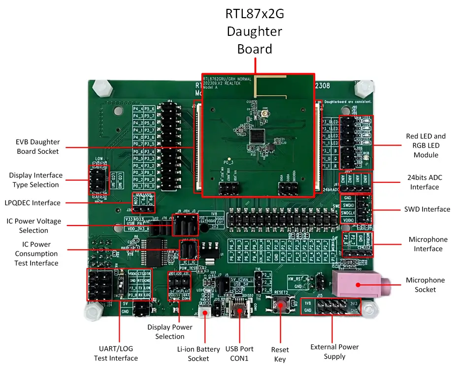

.. _rtl87x2g_evb_a:

RTL87X2G-EVB-A
#############

Overview
********

RTL87x2G Model A evaluation board works along with an interchangeable daughterboard that houses
a real RTL87x2G series SoC.

The RTL87x2G Model A evaluation board is compatible with the following daughter boards:

- RTL8762GRU/GRH Daughter Board
- RTL8762GKU/GKH Daughter Board
- RTL8762GC Daughter Board

Hardware
********

SoC Series
==================
The RTL87x2G series contains various chip types, each supporting different hardware features.

Below are the common hardware features of the RTL87x2G series:

- Realtek KM4 core compatible with Arm Cortex-M55, running at 125MHz
- M-profile Vector Extension (MVE) for vector computation
- 32KB Icache, 16KB Dcache, and 384KB SRAM
- Some part numbers  include MCM 4MB PSRAM
- Hardware keyscan / Quad Decode
- Flash On-The-Fly
- Embedded IR TX/RX
- ISO7816
- SPIC/SPI_m/SPI_s/SDIO/SD(eMMC)
- Low power comparator
- 8CH - AUXADC
- 24bit HD ADC
- CAN
- RMII for Ethernet
- I2S/DAC/AMIC/DMIC/PDM
- SPIC/RGB888/SEGCOM
- USB2.0 High-Speed interface

The `RTL87x2G Introduction`_ has detailed hardware information about specific part number of RTL87x2G series.

Board
==================

RTL87x2G Model A Evaluation Board supports these features:

- 5V to 3.3V & 1.8V LDO power module
- Support QSPI (Group1) display interface
- Support audio module (AMIC, DMIC) interface
- Red LED and RGB LED module
- USB to UART chip, FT232RL

Supported Features
==================

RTL87X2G-MODEL-A-EVB's configuration supports the following hardware features:

+-----------+------------+-------------------------------------+
| Interface | Controller | Driver/Component                    |
+===========+============+=====================================+
| NVIC      | on-chip    | nested vector interrupt controller  |
+-----------+------------+-------------------------------------+
| SYSTICK   | on-chip    | systick                             |
+-----------+------------+-------------------------------------+
| GPIO      | on-chip    | gpio                                |
+-----------+------------+-------------------------------------+
| PINMUX    | on-chip    | pinctrl                             |
+-----------+------------+-------------------------------------+
| CLOCK     | on-chip    | clock control                       |
+-----------+------------+-------------------------------------+
| UART      | on-chip    | serial port                         |
+-----------+------------+-------------------------------------+

Other hardware features are not currently supported by Zephyr.

Connections and IOs
===================

Please refer to `RTL87x2G Model A EVB Interfaces Distribution`_ which has detailed information about board interfaces.

System Clock
============
The RTL87x2G series has a built-in 40MHz crystal oscillator circuit to provide a stable and controllable system clock.

Serial Port
===========

The RTL87x2G series has 6 UARTs. By default, UART2 is configured for the console and log output.

Programming
*************

Flashing Realtek's Images
==========================
To successfully run a Zephyr application on the RTL87x2G board, five essential images provided by Realtek must be programmed into the board,
in addition to the Zephyr image.

 `RTL87x2G Model A EVB Hardware Connection and Download Guide`_ provides a structured approach to understanding these images, wiring for
 download mode, and step-by-step instructions for flashing them.

Flashing Zephyr Image
=======================

Before using the J-Link to flash the Zephyr image, it's essential to first configure it correctly by referring to the `RTL87x2G J-Link Setup Guide`_.
Ensure that the J-Link is properly configured and connected to the board. Once the setup is verified, proceed to build and flash the :zephyr:code-sample:`hello_world` application.

   .. zephyr-app-commands::
      :zephyr-app: samples/hello_world
      :board: rtl87x2g_evb_a/rtl8762gru
      :goals: build flash

Visualizing the message
=======================

#.Connect the UART:

   - Connect P3_2 (TX of UART2) to the RX of the RS232 module.
   - Connect P3_3 (RX of UART2) to the TX of the RS232 module.

#.Open a serial communication tool that you are familiar with:

    - Set the baud rate of the port where the RS232 module is connected to 2000000.

#.Press the reset button:

    - You should see “Hello World! rtl87x2g_evb_a/rtl8762gru” in your terminal.

Debugging
**********

You can debug an application in the usual way.  Here is an example for the
:zephyr:code-sample:`hello_world` application.

.. zephyr-app-commands::
   :zephyr-app: samples/hello_world
   :board: rtl87x2g_evb_a/rtl8762gru
   :maybe-skip-config:
   :goals: debug

References
**********

.. target-notes::

.. _RTL87x2G Introduction:
    https://www.realmcu.com/en/Home/Product/RTL8762G-RTL877xG-Series

.. _RTL87x2G Documentation:
    https://www.realmcu.com/en/Home/DownloadList/c175760b-088e-43d9-86da-1fc9b3f07ec3

.. _RTL87x2G Model A EVB Interfaces Distribution:
    https://docs.realmcu.com/sdk/rtl87x2g/common/en/latest/doc/evb_guide/text_en/model_a.html#interfaces-distribution

.. _RTL87x2G J-Link Setup Guide:
    https://github.com/rtkconnectivity/realtek-zephyr-project/wiki/J%E2%80%90Link-Setup-Guide

.. _RTL87x2G Model A EVB Hardware Connection and Download Guide:
    https://github.com/rtkconnectivity/realtek-zephyr-project/wiki/%5BRTL87X2G-EVB-Model-A%5D-Hardware-Connection-and-Download-Guide
